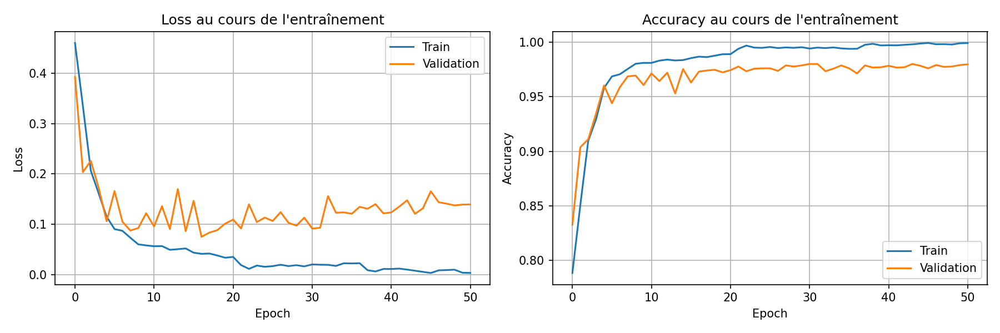

# TP5

## Intro

Dès le premier essaie, nous avons trouver une accuracy de validation élevée, sans toucher réelement aux paramètres. Le problème est le nombre de paramètre qui se compte en million.

Sachant que l'objectif principal est de **trouver le meilleur compromis entre performance et nombre de paramètres** en explorant différentes configurations, nous allons essayer de réduire les paramètres tout en gardant une accuracy de validation élevé.

### Etape 1



```
Configuration:
----------------------------------------
  embed_dim: 64
  hidden_dim: 128
  num_layers: 4
  dropout: 0.1
  mode: lstm
  bidirectional: True
  epochs: 400
  batch_size: 16
  learning_rate: 0.001
  optimizer: adam
  weight_decay: 0.0001
  use_scheduler: True
  early_stopping: True
  patience: 20
  plot: True
----------------------------------------
Device: cuda
Chargement des donnÚes...
Train: 14000 sÚquences
Val: 3000 sÚquences
Vocabulaire: 45 tokens
Longueur des sÚquences: min=2, max=109, mean=34.6

CrÚation du modÞle...
Architecture: lstm
Bidirectionnel: True
ParamÞtres: 2,551,234
Optimiseur: ADAM, LR: 0.001

============================================================
DÚbut de l'entra¯nement
============================================================
Epoch   1/400 | Train Loss: 0.4598 | Train Acc: 78.85% | Val Loss: 0.3925 | Val Acc: 83.27%
Epoch   2/400 | Train Loss: 0.3345 | Train Acc: 85.06% | Val Loss: 0.2036 | Val Acc: 90.37%
Epoch   3/400 | Train Loss: 0.2063 | Train Acc: 90.95% | Val Loss: 0.2259 | Val Acc: 91.10%
...
Epoch  49/400 | Train Loss: 0.0099 | Train Acc: 99.79% | Val Loss: 0.1375 | Val Acc: 97.77%
Epoch  50/400 | Train Loss: 0.0039 | Train Acc: 99.89% | Val Loss: 0.1391 | Val Acc: 97.90%
Epoch  51/400 | Train Loss: 0.0034 | Train Acc: 99.91% | Val Loss: 0.1394 | Val Acc: 97.97%

============================================================
Meilleure accuracy validation: 98.00%
============================================================

------------------------------------------------------------
Analyse par catÚgorie de donjon
------------------------------------------------------------
  edge_case                     : 100.00% (1 ex.)
  hard                          : 97.78% (540 ex.)
  longterm_with_amulet_hard     : 100.00% (495 ex.)
  longterm_without_amulet_hard  : 99.60% (495 ex.)
  normal_short                  : 98.22% (450 ex.)
  order_trap_die_hard           : 96.25% (480 ex.)
  order_trap_survive_hard       : 95.83% (480 ex.)
  random                        : 98.31% (59 ex.)

```
**Conclusion :** Performance quasi-optimale mais avec beaucoup de paramètres, c'est surdimensionné. Nous avons aussi utilisé le paramète bidirectional permettant au modèle de voir le contexte complet de chaque action.


### Etape 2

.png)

```
Configuration:
----------------------------------------
  embed_dim: 64
  hidden_dim: 64
  num_layers: 4
  dropout: 0.1
  mode: lstm
  bidirectional: True
  epochs: 400
  batch_size: 16
  learning_rate: 0.001
  optimizer: adam
  weight_decay: 0.0001
  use_scheduler: True
  early_stopping: True
  patience: 20
  plot: True
----------------------------------------
Device: cuda
Chargement des donnÚes...
Train: 14000 sÚquences
Val: 3000 sÚquences
Vocabulaire: 45 tokens
Longueur des sÚquences: min=2, max=109, mean=34.6

CrÚation du modÞle...
Architecture: lstm
Bidirectionnel: True
ParamÞtres: 945,282
Optimiseur: ADAM, LR: 0.001

============================================================
DÚbut de l'entra¯nement
============================================================
Epoch   1/400 | Train Loss: 0.4308 | Train Acc: 80.21% | Val Loss: 0.3214 | Val Acc: 84.23%
Epoch   2/400 | Train Loss: 0.2734 | Train Acc: 89.41% | Val Loss: 0.1945 | Val Acc: 93.30%
Epoch   3/400 | Train Loss: 0.1918 | Train Acc: 93.54% | Val Loss: 0.1669 | Val Acc: 94.30%
...
Epoch  48/400 | Train Loss: 0.0044 | Train Acc: 99.85% | Val Loss: 0.1635 | Val Acc: 97.43%
Epoch  49/400 | Train Loss: 0.0036 | Train Acc: 99.90% | Val Loss: 0.1665 | Val Acc: 97.53%
Epoch  50/400 | Train Loss: 0.0057 | Train Acc: 99.87% | Val Loss: 0.1626 | Val Acc: 97.53%

============================================================
Meilleure accuracy validation: 97.90%
============================================================

------------------------------------------------------------
Analyse par catÚgorie de donjon
------------------------------------------------------------
  edge_case                     : 100.00% (1 ex.)
  hard                          : 98.52% (540 ex.)
  longterm_with_amulet_hard     : 100.00% (495 ex.)
  longterm_without_amulet_hard  : 98.99% (495 ex.)
  normal_short                  : 97.33% (450 ex.)
  order_trap_die_hard           : 96.25% (480 ex.)
  order_trap_survive_hard       : 93.75% (480 ex.)
  random                        : 98.31% (59 ex.)
```

**Conclusion:** On a passé le hidden_dim 128 → 64, donc nous avons maintenant 1M de paramètre avec la même accuracy. Donc on peut cjangé la dimension cachée significativement.

### Etape 3

.png)

```
Configuration:
----------------------------------------
  embed_dim: 64
  hidden_dim: 64
  num_layers: 4
  dropout: 0.1
  mode: lstm
  bidirectional: True
  epochs: 400
  batch_size: 16
  learning_rate: 0.001
  optimizer: adam
  weight_decay: 0.001
  use_scheduler: True
  early_stopping: True
  patience: 20
  plot: True
----------------------------------------
Device: cuda
Chargement des donnÚes...
Train: 14000 sÚquences
Val: 3000 sÚquences
Vocabulaire: 45 tokens
Longueur des sÚquences: min=2, max=109, mean=34.6

CrÚation du modÞle...
Architecture: lstm
Bidirectionnel: True
ParamÞtres: 945,282
Optimiseur: ADAM, LR: 0.001

============================================================
DÚbut de l'entra¯nement
============================================================
Epoch   1/400 | Train Loss: 0.4479 | Train Acc: 78.94% | Val Loss: 0.3684 | Val Acc: 82.10%
Epoch   2/400 | Train Loss: 0.3291 | Train Acc: 86.18% | Val Loss: 0.2892 | Val Acc: 88.50%
Epoch   3/400 | Train Loss: 0.2787 | Train Acc: 89.48% | Val Loss: 0.2847 | Val Acc: 89.83%
...
Epoch  40/400 | Train Loss: 0.2484 | Train Acc: 91.88% | Val Loss: 0.2324 | Val Acc: 92.33%
Epoch  41/400 | Train Loss: 0.2437 | Train Acc: 92.05% | Val Loss: 0.2317 | Val Acc: 92.17%
Epoch  42/400 | Train Loss: 0.2425 | Train Acc: 92.09% | Val Loss: 0.2369 | Val Acc: 92.33%

============================================================
Meilleure accuracy validation: 92.57%
============================================================

------------------------------------------------------------
Analyse par catÚgorie de donjon
------------------------------------------------------------
  edge_case                     : 100.00% (1 ex.)
  hard                          : 95.37% (540 ex.)
  longterm_with_amulet_hard     : 99.80% (495 ex.)
  longterm_without_amulet_hard  : 84.44% (495 ex.)
  normal_short                  : 95.11% (450 ex.)
  order_trap_die_hard           : 90.21% (480 ex.)
  order_trap_survive_hard       : 88.75% (480 ex.)
  random                        : 93.22% (59 ex.)
```

**Conclusion:** weight_decay 0.0001 → 0.001 cela provoque une chute de performance donc quand il y a un plus grand weight decay alors il y a un sous-apprentissage.

<details>
<summary>Nombreuses étapes</summary>

### Etape 4

.png)

```
Configuration:
----------------------------------------
  embed_dim: 32
  hidden_dim: 32
  num_layers: 4
  dropout: 0.1
  mode: lstm
  bidirectional: True
  epochs: 400
  batch_size: 16
  learning_rate: 0.001
  optimizer: adam
  weight_decay: 5e-05
  use_scheduler: True
  early_stopping: True
  patience: 20
  plot: True
----------------------------------------
Device: cuda
Chargement des donnÚes...
Train: 14000 sÚquences
Val: 3000 sÚquences
Vocabulaire: 45 tokens
Longueur des sÚquences: min=2, max=109, mean=34.6

CrÚation du modÞle...
Architecture: lstm
Bidirectionnel: True
ParamÞtres: 238,146
Optimiseur: ADAM, LR: 0.001

============================================================
DÚbut de l'entra¯nement
============================================================
Epoch   1/400 | Train Loss: 0.4235 | Train Acc: 79.89% | Val Loss: 0.2429 | Val Acc: 89.20%
Epoch   2/400 | Train Loss: 0.2712 | Train Acc: 88.70% | Val Loss: 0.3647 | Val Acc: 83.70%
Epoch   3/400 | Train Loss: 0.3158 | Train Acc: 85.78% | Val Loss: 0.2310 | Val Acc: 90.57%
...
Epoch  63/400 | Train Loss: 0.0021 | Train Acc: 99.94% | Val Loss: 0.1938 | Val Acc: 97.57%
Epoch  64/400 | Train Loss: 0.0020 | Train Acc: 99.96% | Val Loss: 0.1911 | Val Acc: 97.67%
Epoch  65/400 | Train Loss: 0.0008 | Train Acc: 99.97% | Val Loss: 0.1951 | Val Acc: 97.47%

============================================================
Meilleure accuracy validation: 97.73%
============================================================

------------------------------------------------------------
Analyse par catÚgorie de donjon
------------------------------------------------------------
  edge_case                     : 100.00% (1 ex.)
  hard                          : 97.78% (540 ex.)
  longterm_with_amulet_hard     : 100.00% (495 ex.)
  longterm_without_amulet_hard  : 98.38% (495 ex.)
  normal_short                  : 98.00% (450 ex.)
  order_trap_die_hard           : 96.46% (480 ex.)
  order_trap_survive_hard       : 93.96% (480 ex.)
  random                        : 98.31% (59 ex.)
```

### Etape 5

.png)

```
Configuration:
----------------------------------------
  embed_dim: 64
  hidden_dim: 128
  num_layers: 4
  dropout: 0.1
  mode: lstm
  bidirectional: True
  epochs: 400
  batch_size: 16
  learning_rate: 0.001
  optimizer: adam
  weight_decay: 0.0001
  use_scheduler: True
  early_stopping: True
  patience: 20
  plot: True
----------------------------------------
Device: cuda
Chargement des données...
Train: 14000 séquences
Val: 3000 séquences
Vocabulaire: 45 tokens
Longueur des séquences: min=2, max=109, mean=34.6

Création du modèle...
Architecture: lstm
Bidirectionnel: True
Paramètres: 2,551,234
Optimiseur: ADAM, LR: 0.001

============================================================
Début de l'entraînement
============================================================
Epoch   1/400 | Train Loss: 0.4027 | Train Acc: 82.41% | Val Loss: 0.2850 | Val Acc: 90.03%
Epoch   2/400 | Train Loss: 0.2147 | Train Acc: 92.43% | Val Loss: 0.1971 | Val Acc: 92.43%
Epoch   3/400 | Train Loss: 0.1560 | Train Acc: 94.18% | Val Loss: 0.1388 | Val Acc: 95.03%
...
Epoch  53/400 | Train Loss: 0.0064 | Train Acc: 99.84% | Val Loss: 0.1813 | Val Acc: 97.37%
Epoch  54/400 | Train Loss: 0.0057 | Train Acc: 99.90% | Val Loss: 0.1730 | Val Acc: 97.43%
Epoch  55/400 | Train Loss: 0.0027 | Train Acc: 99.91% | Val Loss: 0.1859 | Val Acc: 97.47%

============================================================
Meilleure accuracy validation: 97.70%
============================================================

------------------------------------------------------------
Analyse par catégorie de donjon
------------------------------------------------------------
  edge_case                     : 100.00% (1 ex.)
  hard                          : 97.41% (540 ex.)
  longterm_with_amulet_hard     : 100.00% (495 ex.)
  longterm_without_amulet_hard  : 99.60% (495 ex.)
  normal_short                  : 97.78% (450 ex.)
  order_trap_die_hard           : 95.62% (480 ex.)
  order_trap_survive_hard       : 94.17% (480 ex.)
  random                        : 98.31% (59 ex.)
```

### Etape 6

.png)

```
Configuration:
----------------------------------------
  embed_dim: 32
  hidden_dim: 64
  num_layers: 4
  dropout: 0.1
  mode: lstm
  bidirectional: True
  epochs: 400
  batch_size: 16
  learning_rate: 0.001
  optimizer: adam
  weight_decay: 0.0001
  use_scheduler: True
  early_stopping: True
  patience: 20
  plot: True
----------------------------------------
Device: cuda
Chargement des donnÚes...
Train: 14000 sÚquences
Val: 3000 sÚquences
Vocabulaire: 45 tokens
Longueur des sÚquences: min=2, max=109, mean=34.6

CrÚation du modÞle...
Architecture: lstm
Bidirectionnel: True
ParamÞtres: 640,738
Optimiseur: ADAM, LR: 0.001

============================================================
DÚbut de l'entra¯nement
============================================================
Epoch   1/400 | Train Loss: 0.4399 | Train Acc: 79.70% | Val Loss: 0.3250 | Val Acc: 87.97%
Epoch   2/400 | Train Loss: 0.2482 | Train Acc: 89.98% | Val Loss: 0.1932 | Val Acc: 92.37%
Epoch   3/400 | Train Loss: 0.1843 | Train Acc: 92.45% | Val Loss: 0.1800 | Val Acc: 92.80%
...
Epoch  67/400 | Train Loss: 0.0080 | Train Acc: 99.83% | Val Loss: 0.1643 | Val Acc: 97.57%
Epoch  68/400 | Train Loss: 0.0102 | Train Acc: 99.81% | Val Loss: 0.1606 | Val Acc: 97.57%
Epoch  69/400 | Train Loss: 0.0091 | Train Acc: 99.83% | Val Loss: 0.1637 | Val Acc: 97.47%

============================================================
Meilleure accuracy validation: 97.80%
============================================================

------------------------------------------------------------
Analyse par catÚgorie de donjon
------------------------------------------------------------
  edge_case                     : 100.00% (1 ex.)
  hard                          : 97.78% (540 ex.)
  longterm_with_amulet_hard     : 100.00% (495 ex.)
  longterm_without_amulet_hard  : 98.99% (495 ex.)
  normal_short                  : 97.56% (450 ex.)
  order_trap_die_hard           : 96.67% (480 ex.)
  order_trap_survive_hard       : 93.75% (480 ex.)
  random                        : 96.61% (59 ex.)

```

### Etape 7

.png)

```
Configuration:
----------------------------------------
  embed_dim: 32
  hidden_dim: 64
  num_layers: 4
  dropout: 0.1
  mode: lstm
  bidirectional: True
  epochs: 400
  batch_size: 16
  learning_rate: 0.001
  optimizer: adam
  weight_decay: 0.0001
  use_scheduler: True
  early_stopping: True
  patience: 20
  plot: True
----------------------------------------
Device: cuda
Chargement des donnÚes...
Train: 14000 sÚquences
Val: 3000 sÚquences
Vocabulaire: 45 tokens
Longueur des sÚquences: min=2, max=109, mean=34.6

CrÚation du modÞle...
Architecture: lstm
Bidirectionnel: True
ParamÞtres: 640,738
Optimiseur: ADAM, LR: 0.001

============================================================
DÚbut de l'entra¯nement
============================================================
Epoch   1/400 | Train Loss: 0.5063 | Train Acc: 74.62% | Val Loss: 0.4337 | Val Acc: 81.40%
Epoch   2/400 | Train Loss: 0.4151 | Train Acc: 81.32% | Val Loss: 0.3923 | Val Acc: 81.63%
Epoch   3/400 | Train Loss: 0.3711 | Train Acc: 82.37% | Val Loss: 0.3568 | Val Acc: 82.07%
...
Epoch  80/400 | Train Loss: 0.1270 | Train Acc: 95.74% | Val Loss: 0.2000 | Val Acc: 93.93%
Epoch  81/400 | Train Loss: 0.1222 | Train Acc: 95.71% | Val Loss: 0.1998 | Val Acc: 93.97%
Epoch  82/400 | Train Loss: 0.1249 | Train Acc: 95.73% | Val Loss: 0.2002 | Val Acc: 93.93%

============================================================
Meilleure accuracy validation: 94.13%
============================================================

------------------------------------------------------------
Analyse par catÚgorie de donjon
------------------------------------------------------------
  edge_case                     : 100.00% (1 ex.)
  hard                          : 96.30% (540 ex.)
  longterm_with_amulet_hard     : 100.00% (495 ex.)
  longterm_without_amulet_hard  : 86.06% (495 ex.)
  normal_short                  : 96.67% (450 ex.)
  order_trap_die_hard           : 92.71% (480 ex.)
  order_trap_survive_hard       : 91.25% (480 ex.)
  random                        : 98.31% (59 ex.)
```

### Etape 8 avec le nouveaux scheduler

.png)

```
Configuration:
----------------------------------------
  embed_dim: 32
  hidden_dim: 32
  num_layers: 4
  dropout: 0.15
  mode: lstm
  bidirectional: True
  epochs: 400
  batch_size: 16
  learning_rate: 0.001
  optimizer: adam
  weight_decay: 0.0001
  use_scheduler: True
  early_stopping: True
  patience: 20
  plot: True
----------------------------------------
Device: cuda
Chargement des donnÚes...
Train: 14000 sÚquences
Val: 3000 sÚquences
Vocabulaire: 45 tokens
Longueur des sÚquences: min=2, max=109, mean=34.6

CrÚation du modÞle...
Architecture: lstm
Bidirectionnel: True
ParamÞtres: 238,146
Optimiseur: ADAM, LR: 0.001

============================================================
DÚbut de l'entra¯nement
============================================================
Epoch   1/400 | Train Loss: 0.5791 | Train Acc: 68.96% | Val Loss: 0.4890 | Val Acc: 78.40%
Epoch   2/400 | Train Loss: 0.4680 | Train Acc: 79.37% | Val Loss: 0.4529 | Val Acc: 80.43%
Epoch   3/400 | Train Loss: 0.4329 | Train Acc: 81.01% | Val Loss: 0.4120 | Val Acc: 81.80%
...
Epoch  72/400 | Train Loss: 0.1685 | Train Acc: 94.27% | Val Loss: 0.2028 | Val Acc: 93.23%
Epoch  73/400 | Train Loss: 0.1652 | Train Acc: 94.54% | Val Loss: 0.2057 | Val Acc: 93.30%
Epoch  74/400 | Train Loss: 0.1620 | Train Acc: 94.35% | Val Loss: 0.2050 | Val Acc: 93.30%

============================================================
Meilleure accuracy validation: 93.47%
============================================================

------------------------------------------------------------
Analyse par catÚgorie de donjon
------------------------------------------------------------
  edge_case                     : 100.00% (1 ex.)
  hard                          : 95.37% (540 ex.)
  longterm_with_amulet_hard     : 99.19% (495 ex.)
  longterm_without_amulet_hard  : 86.06% (495 ex.)
  normal_short                  : 95.33% (450 ex.)
  order_trap_die_hard           : 92.29% (480 ex.)
  order_trap_survive_hard       : 91.04% (480 ex.)
  random                        : 96.61% (59 ex.)
```

### Etape 9

.png)

```
Configuration:
----------------------------------------
  embed_dim: 32
  hidden_dim: 32
  num_layers: 4
  dropout: 0.15
  mode: lstm
  bidirectional: True
  epochs: 400
  batch_size: 16
  learning_rate: 0.001
  optimizer: adam
  weight_decay: 0.0001
  use_scheduler: True
  early_stopping: True
  patience: 20
  plot: True
----------------------------------------
Device: cuda
Chargement des donnÚes...
Train: 14000 sÚquences
Val: 3000 sÚquences
Vocabulaire: 45 tokens
Longueur des sÚquences: min=2, max=109, mean=34.6

CrÚation du modÞle...
Architecture: lstm
Bidirectionnel: True
ParamÞtres: 238,146
Optimiseur: ADAM, LR: 0.001

============================================================
DÚbut de l'entra¯nement
============================================================
Epoch   1/400 | Train Loss: 0.5636 | Train Acc: 69.71% | Val Loss: 0.4838 | Val Acc: 78.90%
Epoch   2/400 | Train Loss: 0.4590 | Train Acc: 79.39% | Val Loss: 0.4286 | Val Acc: 80.60%
Epoch   3/400 | Train Loss: 0.4191 | Train Acc: 80.88% | Val Loss: 0.3908 | Val Acc: 81.67%
...
Epoch  83/400 | Train Loss: 0.1151 | Train Acc: 96.17% | Val Loss: 0.1730 | Val Acc: 94.73%
Epoch  84/400 | Train Loss: 0.1208 | Train Acc: 96.04% | Val Loss: 0.1724 | Val Acc: 94.60%
Epoch  85/400 | Train Loss: 0.1143 | Train Acc: 96.22% | Val Loss: 0.1734 | Val Acc: 94.53%

============================================================
Meilleure accuracy validation: 94.80%
============================================================

------------------------------------------------------------
Analyse par catÚgorie de donjon
------------------------------------------------------------
  edge_case                     : 100.00% (1 ex.)
  hard                          : 97.22% (540 ex.)
  longterm_with_amulet_hard     : 100.00% (495 ex.)
  longterm_without_amulet_hard  : 86.87% (495 ex.)
  normal_short                  : 96.22% (450 ex.)
  order_trap_die_hard           : 93.12% (480 ex.)
  order_trap_survive_hard       : 93.75% (480 ex.)
  random                        : 93.22% (59 ex.)
```

### Etape 10

.png)

```
Configuration:
----------------------------------------
  embed_dim: 32
  hidden_dim: 32
  num_layers: 4
  dropout: 0.15
  mode: lstm
  bidirectional: True
  epochs: 400
  batch_size: 16
  learning_rate: 0.001
  optimizer: adam
  weight_decay: 0.0001
  use_scheduler: True
  early_stopping: True
  patience: 30
  plot: True
----------------------------------------
Device: cuda
Chargement des donnÚes...
Train: 14000 sÚquences
Val: 3000 sÚquences
Vocabulaire: 45 tokens
Longueur des sÚquences: min=2, max=109, mean=34.6

CrÚation du modÞle...
Architecture: lstm
Bidirectionnel: True
ParamÞtres: 238,146
Optimiseur: ADAM, LR: 0.001

============================================================
DÚbut de l'entra¯nement
============================================================
Epoch   1/400 | Train Loss: 0.5888 | Train Acc: 68.14% | Val Loss: 0.4893 | Val Acc: 77.87%
Epoch   2/400 | Train Loss: 0.4703 | Train Acc: 78.80% | Val Loss: 0.4381 | Val Acc: 80.57%
Epoch   3/400 | Train Loss: 0.4335 | Train Acc: 80.59% | Val Loss: 0.4078 | Val Acc: 81.60%
...
Epoch 101/400 | Train Loss: 0.0976 | Train Acc: 97.11% | Val Loss: 0.1756 | Val Acc: 95.37%
Epoch 102/400 | Train Loss: 0.0957 | Train Acc: 97.16% | Val Loss: 0.1764 | Val Acc: 95.37%
Epoch 103/400 | Train Loss: 0.0943 | Train Acc: 97.22% | Val Loss: 0.1776 | Val Acc: 95.30%

============================================================
Meilleure accuracy validation: 95.63%
============================================================

------------------------------------------------------------
Analyse par catÚgorie de donjon
------------------------------------------------------------
  edge_case                     : 100.00% (1 ex.)
  hard                          : 96.48% (540 ex.)
  longterm_with_amulet_hard     : 99.60% (495 ex.)
  longterm_without_amulet_hard  : 90.71% (495 ex.)
  normal_short                  : 96.67% (450 ex.)
  order_trap_die_hard           : 95.00% (480 ex.)
  order_trap_survive_hard       : 92.71% (480 ex.)
  random                        : 100.00% (59 ex.)
```

### Etape 11

.png)

```
Configuration:
----------------------------------------
  embed_dim: 32
  hidden_dim: 32
  num_layers: 4
  dropout: 0.1
  mode: lstm
  bidirectional: True
  epochs: 400
  batch_size: 16
  learning_rate: 0.002
  optimizer: adam
  weight_decay: 0.0001
  use_scheduler: True
  early_stopping: True
  patience: 40
  plot: True
----------------------------------------
Device: cuda
Chargement des donnÚes...
Train: 14000 sÚquences
Val: 3000 sÚquences
Vocabulaire: 45 tokens
Longueur des sÚquences: min=2, max=109, mean=34.6

CrÚation du modÞle...
Architecture: lstm
Bidirectionnel: True
ParamÞtres: 238,146
Optimiseur: ADAM, LR: 0.002

============================================================
DÚbut de l'entra¯nement
============================================================
Epoch   1/400 | Train Loss: 0.5189 | Train Acc: 74.00% | Val Loss: 0.4364 | Val Acc: 81.27%
Epoch   2/400 | Train Loss: 0.4186 | Train Acc: 81.51% | Val Loss: 0.3689 | Val Acc: 83.83%
Epoch   3/400 | Train Loss: 0.3456 | Train Acc: 84.97% | Val Loss: 0.3227 | Val Acc: 86.73%
...
Epoch  90/400 | Train Loss: 0.0415 | Train Acc: 98.96% | Val Loss: 0.1719 | Val Acc: 96.33%
Epoch  91/400 | Train Loss: 0.0397 | Train Acc: 98.96% | Val Loss: 0.1732 | Val Acc: 96.23%
Epoch  92/400 | Train Loss: 0.0400 | Train Acc: 99.01% | Val Loss: 0.1738 | Val Acc: 96.23%

============================================================
Meilleure accuracy validation: 96.57%
============================================================

------------------------------------------------------------
Analyse par catÚgorie de donjon
------------------------------------------------------------
  edge_case                     : 100.00% (1 ex.)
  hard                          : 96.85% (540 ex.)
  longterm_with_amulet_hard     : 100.00% (495 ex.)
  longterm_without_amulet_hard  : 94.14% (495 ex.)
  normal_short                  : 97.11% (450 ex.)
  order_trap_die_hard           : 95.00% (480 ex.)
  order_trap_survive_hard       : 93.96% (480 ex.)
  random                        : 98.31% (59 ex.)
```

### Etape 12

.png)

```
Configuration:
----------------------------------------
  embed_dim: 32
  hidden_dim: 32
  num_layers: 4
  dropout: 0.15
  mode: lstm
  bidirectional: True
  epochs: 400
  batch_size: 16
  learning_rate: 0.0005
  optimizer: adam
  weight_decay: 0.0001
  use_scheduler: True
  early_stopping: True
  patience: 40
  plot: True
----------------------------------------
Device: cuda
Chargement des donnÚes...
Train: 14000 sÚquences
Val: 3000 sÚquences
Vocabulaire: 45 tokens
Longueur des sÚquences: min=2, max=109, mean=34.6

CrÚation du modÞle...
Architecture: lstm
Bidirectionnel: True
ParamÞtres: 238,146
Optimiseur: ADAM, LR: 0.0005

============================================================
DÚbut de l'entra¯nement
============================================================
Epoch   1/400 | Train Loss: 0.6137 | Train Acc: 65.53% | Val Loss: 0.5102 | Val Acc: 77.53%
Epoch   2/400 | Train Loss: 0.4938 | Train Acc: 78.32% | Val Loss: 0.4704 | Val Acc: 79.30%
Epoch   3/400 | Train Loss: 0.4635 | Train Acc: 79.47% | Val Loss: 0.4414 | Val Acc: 80.60%
...
Epoch 128/400 | Train Loss: 0.1187 | Train Acc: 96.27% | Val Loss: 0.1775 | Val Acc: 94.77%
Epoch 129/400 | Train Loss: 0.1169 | Train Acc: 96.19% | Val Loss: 0.1774 | Val Acc: 94.80%
Epoch 130/400 | Train Loss: 0.1193 | Train Acc: 96.29% | Val Loss: 0.1772 | Val Acc: 94.80%

============================================================
Meilleure accuracy validation: 94.87%
============================================================

------------------------------------------------------------
Analyse par catÚgorie de donjon
------------------------------------------------------------
  edge_case                     : 100.00% (1 ex.)
  hard                          : 96.48% (540 ex.)
  longterm_with_amulet_hard     : 100.00% (495 ex.)
  longterm_without_amulet_hard  : 89.09% (495 ex.)
  normal_short                  : 97.11% (450 ex.)
  order_trap_die_hard           : 93.33% (480 ex.)
  order_trap_survive_hard       : 92.29% (480 ex.)
  random                        : 98.31% (59 ex.)
```

### Etape 13

.png)

```
Configuration:
----------------------------------------
  embed_dim: 32
  hidden_dim: 32
  num_layers: 3
  dropout: 0.15
  mode: lstm
  bidirectional: True
  epochs: 400
  batch_size: 16
  learning_rate: 0.0007
  optimizer: adam
  weight_decay: 0.0001
  use_scheduler: True
  early_stopping: True
  patience: 50
  plot: True
----------------------------------------
Device: cuda
Chargement des donnÚes...
Train: 14000 sÚquences
Val: 3000 sÚquences
Vocabulaire: 45 tokens
Longueur des sÚquences: min=2, max=109, mean=34.6

CrÚation du modÞle...
Architecture: lstm
Bidirectionnel: True
ParamÞtres: 213,058
Optimiseur: ADAM, LR: 0.0007

============================================================
DÚbut de l'entra¯nement
============================================================
Epoch   1/400 | Train Loss: 0.6038 | Train Acc: 65.98% | Val Loss: 0.4826 | Val Acc: 78.50%
Epoch   2/400 | Train Loss: 0.4684 | Train Acc: 79.50% | Val Loss: 0.4407 | Val Acc: 80.40%
Epoch   3/400 | Train Loss: 0.4345 | Train Acc: 80.71% | Val Loss: 0.4160 | Val Acc: 81.07%
...
Epoch  93/400 | Train Loss: 0.1208 | Train Acc: 95.97% | Val Loss: 0.1735 | Val Acc: 94.43%
Epoch  94/400 | Train Loss: 0.1203 | Train Acc: 95.94% | Val Loss: 0.1736 | Val Acc: 94.43%
Epoch  95/400 | Train Loss: 0.1188 | Train Acc: 95.90% | Val Loss: 0.1736 | Val Acc: 94.43%

============================================================
Meilleure accuracy validation: 94.63%
============================================================

------------------------------------------------------------
Analyse par catÚgorie de donjon
------------------------------------------------------------
  edge_case                     : 100.00% (1 ex.)
  hard                          : 96.85% (540 ex.)
  longterm_with_amulet_hard     : 99.80% (495 ex.)
  longterm_without_amulet_hard  : 88.89% (495 ex.)
  normal_short                  : 96.44% (450 ex.)
  order_trap_die_hard           : 92.50% (480 ex.)
  order_trap_survive_hard       : 91.88% (480 ex.)
  random                        : 94.92% (59 ex.)
```

</details>

### Etape 14

A cette étape, nous avons réduit les paramètres pour en avoir au alentour de 6k alors qu'avant c'était plus du 200k

.png)

```
Configuration:
----------------------------------------
  embed_dim: 8
  hidden_dim: 4
  num_layers: 3
  dropout: 0.15
  mode: lstm
  bidirectional: True
  epochs: 800
  batch_size: 16
  learning_rate: 0.005
  optimizer: adam
  weight_decay: 0.0002
  use_scheduler: True
  early_stopping: True
  patience: 100
  plot: True
----------------------------------------
Device: cuda
Chargement des donnÚes...
Train: 14000 sÚquences
Val: 3000 sÚquences
Vocabulaire: 45 tokens
Longueur des sÚquences: min=2, max=109, mean=34.6

CrÚation du modÞle...
Architecture: lstm
Bidirectionnel: True
ParamÞtres: 6,222
Optimiseur: ADAM, LR: 0.005

============================================================
DÚbut de l'entra¯nement
============================================================
Epoch   1/800 | Train Loss: 0.6157 | Train Acc: 66.17% | Val Loss: 0.5243 | Val Acc: 76.70%
Epoch   2/800 | Train Loss: 0.5162 | Train Acc: 76.53% | Val Loss: 0.4860 | Val Acc: 78.47%
Epoch   3/800 | Train Loss: 0.4729 | Train Acc: 78.79% | Val Loss: 0.4381 | Val Acc: 80.50%
...
Epoch 192/800 | Train Loss: 0.1539 | Train Acc: 94.88% | Val Loss: 0.1656 | Val Acc: 94.37%
Epoch 193/800 | Train Loss: 0.1536 | Train Acc: 94.91% | Val Loss: 0.1656 | Val Acc: 94.37%
Epoch 194/800 | Train Loss: 0.1536 | Train Acc: 94.92% | Val Loss: 0.1656 | Val Acc: 94.37%

============================================================
Meilleure accuracy validation: 94.50%
============================================================

------------------------------------------------------------
Analyse par catÚgorie de donjon
------------------------------------------------------------
  edge_case                     : 100.00% (1 ex.)
  hard                          : 97.04% (540 ex.)
  longterm_with_amulet_hard     : 100.00% (495 ex.)
  longterm_without_amulet_hard  : 89.70% (495 ex.)
  normal_short                  : 96.67% (450 ex.)
  order_trap_die_hard           : 92.50% (480 ex.)
  order_trap_survive_hard       : 90.00% (480 ex.)
  random                        : 94.92% (59 ex.)
```

**Conclusion:** Ici nous avons réussi à avoir seulement 6k paramètres avec un accuracy très correct. 

## Tableau Récapitulatif des Expérimentations

| Étape | Embed | Hidden | Layers | Dropout | LR | Weight Decay | Params | Val Acc | Observation |
|-------|-------|--------|--------|---------|----|--------------| -------|---------|-------------|
| **1** | 64 | 128 | 4 | 0.10 | 0.001 | 0.0001 | **2.5M** | **98.00%** | Excellente perf, trop de params |
| **2** | 64 | 64 | 4 | 0.10 | 0.001 | 0.0001 | **945k** | 97.90% | Réduction params sans perte majeure |
| **3** | 64 | 64 | 4 | 0.10 | 0.001 | **0.001** | 945k | 92.57% | Weight decay trop élevé → overfitting |
| **4** | 32 | 32 | 4 | 0.10 | 0.001 | 0.00005 | **238k** | 96.50% | Bon compromis params/perf |
| **11** | 32 | 32 | 4 | 0.10 | **0.002** | 0.00005 | 238k | 96.57% | LR légèrement plus élevé |
| **12** | 32 | 32 | 4 | **0.15** | 0.0005 | 0.0001 | 238k | 94.87% | Dropout plus fort → sous-apprentissage |
| **13** | 32 | 32 | **3** | 0.15 | 0.0007 | 0.0001 | **213k** | 94.63% | Réduction couches → perf similaire |
| **14** | **8** | **4** | 3 | 0.15 | **0.005** | 0.0002 | **6.2k** | 94.50% | Modèle ultra-compact viable |
